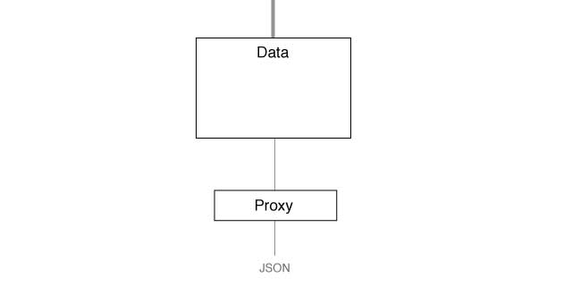
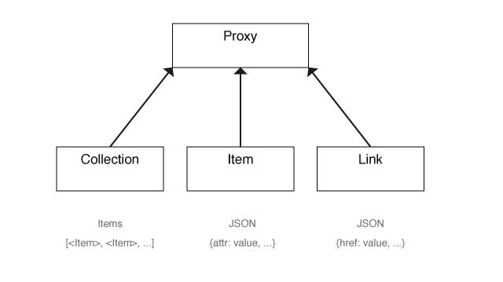

LHS
===

LocalHttpServices : Rails gem providing an easy interface to use http services here at local

## Service
A Service connects your application to backend endpoints providing you access to their data.


### Service Example
```
class LHS::Feedback < LHS::Service

  endpoint ':datastore/v2/content-ads/:campaign_id/feedbacks'
  endpoint ':datastore/v2/feedbacks'

end

LHS::Feedback.where(has_reviews: true) // #<LHS::Data>
```

## Data
Data contains raw data (json) and a proxy that is used to access data.



## Proxy
A proxy is used to access data. It is separated in the three types: Collection, Item and Link.


### Collection Example
```
data = LHS::Feedback.where(has_reviews: true) // #<LHS::Data @_proxy_=#<LHS::Collection>>
data.count // 10
data.total // 98
```

### Item Example
```
data = LHS::Feedback.where(has_reviews: true).first // #<LHS::Data @_proxy_=#<LHS::Item>>
data.recommended // true
data.created_date // Fri, 19 Sep 2014 14:03:35 +0200
data._raw_ // {...}
```

### Link Example
```
data = LHS::Feedback.where(has_reviews: true).first.campaign // #<LHS::Data @_proxy_=#<LHS::Link>>
data._raw_ // {"href"=>"http://datastore-stg.lb-service.sunrise.intra.local.ch/v2/content-ads/51dfc5690cf271c375c5a12d"}
data.id // "51dfc5690cf271c375c5a12d" (fetched from the backend)
```
