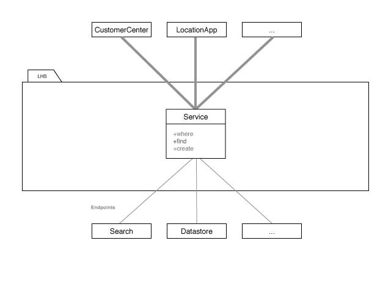

Services
===

A Service makes data available using multiple endpoints.



## Endpoints

You setup a service by configure one or multiple backend endpoints that provide data for that service.

```ruby
class Feedback < LHS::Service

  endpoint ':datastore/v2/content-ads/:campaign_id/feedbacks'
  endpoint ':datastore/v2/feedbacks'

end
```

If you try to setup a service with clashing endpoints it will immediately raise an exception.

```ruby
class Feedback < LHS::Service

  endpoint ':datastore/v2/reviews'
  endpoint ':datastore/v2/feedbacks'

end
// raises: Clashing endpoints.

```

## Find multiple records

You can query the services by using `where`.

```ruby
  Feedback.where(has_reviews: true) #<LHS::Data @_proxy_=#<LHS::Collection>>
```

This uses the `:datastore/v2/feedbacks` endpoint, cause `:campaign_id` was not provided.
In addition it would add `?has_reviews=true` to the get parameters.

```ruby
  Feedback.where(campaign_id: 'fq-a81ngsl1d') #<LHS::Data @_proxy_=#<LHS::Collection>>
```
Uses the `:datastore/v2/content-ads/:campaign_id/feedbacks` endpoint.

→ [Read more about collections](collections.md)

## Find single records

`find` finds a unique item by uniqe identifier (usualy id).

If no record is found an error is raised.

```ruby
  Feedback.find('z12f-3asm3ngals') #<LHS::Data @_proxy_=#<LHS::Item>>
```

`find_by` finds the first record matching the specified conditions.

If no record is found, returns `nil`.

```ruby
  Feedback.find_by(id: 'z12f-3asm3ngals') #<LHS::Data @_proxy_=#<LHS::Item>>
  Feedback.find_by(id: 'doesntexist') // nil
```

→ [Read more about items](items.md)

## Batch processing

** Be carefull using methods for batch processing. They could result in a lot of HTTP requests! **

`all` fetches all records from the backend by doing multiple requests if necessary.

```ruby
data = Feedback.all #<LHS::Data @_proxy_=#<LHS::Collection>>
data.count // 998
data.total // 998
```

→ [Read more about collections](collections.md)

`find_each` is a more fine grained way to process single records that are fetched in batches.

```ruby
Feedback.find_each(start: 50, batch_size: 20, params: { has_reviews: true }) do |feedback|
  # Iterates over each record. Starts with record nr. 50 and fetches 20 records each batch.
  feedback #<LHS::Data @_proxy_=#<LHS::Item>>
end
```

`find_in_batches` is used by `find_each` and processes batches.
```ruby
Feedback.find_in_batches(start: 50, batch_size: 20, params: { has_reviews: true }) do |feedbacks|
  # Iterates over multiple records (batch size is 20). Starts with record nr. 50 and fetches 20 records each batch.
  feedbacks #<LHS::Data @_proxy_=#<LHS::Collection>>
end
```

## Create records

```ruby
  feedback = Feedback.create(
    recommended: true,
    source_id: 'aaa',
    content_ad_id: '1z-5r1fkaj'
  ) #<LHS::Data @_proxy_=#<LHS::Item>>
```

When creation fails, the object contains errors in its `errors` attribute:

```ruby
  feedback.errors #<LHS::Errors>
  feedback.errors.include?(:ratings) # true
  feedback.errors[:ratings] # ['REQUIRED_PROPERTY_VALUE']
  record.errors.messages # {:ratings=>["REQUIRED_PROPERTY_VALUE"], :recommended=>["REQUIRED_PROPERTY_VALUE"]}
```

## Build new records

Build and persist new items from scratch.

```ruby
  monkey = MonkeyService.build(name: 'Steve')
  monkey.save
```

→ [Read more about items](items.md)


## Include linked resources

A service lets you specify in advance all the linked resources that you want to inlcude in the results.
This is possible by specifying the includes method. With includes, a service ensures that all matching explicitly linked resources are loaded and merged.

```ruby
  # Feedbacks are linked with campaigns (content_ads) that are linked with entries.
  feedbacks = Feedback.includes(campaign: :entry).where(has_reviews: true)
  feedbacks.first.campaign.entry.name # 'Casa Ferlin'
```
